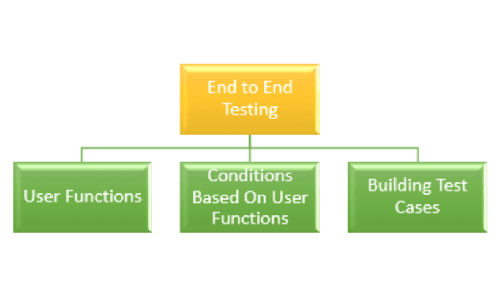

# End to End Testing

End to end testing is a very common testing methodology where the objective is to test how an application works by checking the flow from start to end. Not only the application flow under dev environment is tested, but the tester also has to check how it behaves once integrated with the external interface. Usually, this testing phase is executed after functional testing and system testing is completed. The technical definition of end to end testing is – a type of testing to ensure that behavioural flow of an application works as expected by performing a complete, thorough testing, from the beginning to end of the product-user interaction in order to realize any dependency or flaw in the workflow of the application.

###  Why End to End Testing is Required?

In the current Agile world, an application is interconnected and integrated with multiple systems that are outside of the application environment. The entire flow of the application thus gets complicated. End to end testing ensures that the application is tested from all layers – front end to backend along with its interfaces and the endpoints. Let’s see why it is needed.

**Health of Back-end** – End to end testing checks the database as well as backend layer of the application. Since the core functionalities of the application depend on the back end and database layer, testing this layer checks how accurately the application can perform the critical functions.

**Errors in Distributed Environment** – End to end testing makes it possible to test an application that is based on SOA or cloud environments. Also, in application consisting multiple components that require an all-around check, it helps to pinpoint problems in the core.

**App Behavior Validation in Multi-tier System** – In applications having a complex architecture or a workflow that is subdivided into multiple tiers, the end to end testing checks the overall functioning as well as functioning in individual layers. It also identifies the behavior of the application in connected systems.

**Ensuring Interaction Accuracy** – Since front-end testing is also involved, it is ensured that the application behaves accurately a provides a user experience that is consistent across multiple platforms, devices and environments.

**Reusability of Test Cases** – During different processes of the application’s lifecycle, the end to end testing provides the option to execute test cases that are repeatable. Moreover, it also increases the test coverage and makes the owner confident in the performance of the application.

Now that we have seen why the E2E testing is required, let’s see how it is carried out.

###  How End To End Testing Is Performed?

Let’s summarize the key activities that are must to include during the end to end testing.

* Thoroughly analyze the requirements before starting the testing phase.
* Setting up the test environment following all the prerequisites.
* Analyze the software and hardware requirements \( both minimum as well as recommended configuration\).
* Study the main system along with connected subsystems.
* List down the responsibilities of all systems involved.
* List down the testing methods along with the description of the standards to be followed.
* Design the test cases and while doing so also trace the requirement matrix.
* Save the output results and input data before testing each system.

Key activities being set, let’s dive in deep.

End to end testing process can be divided into 3 categories.

###  User Functions

As a part of user functions, the following activities should be performed.

* List down the software system’s features and the subsystems that are interconnected.
* Keep track of the actions performed for any functionality along with the input data and output results.
* Between different functionalities performed from the user’s end find out if there is any relation.
* Check whether the user functions are independent or can be reused. In short – find their nature.

Let’s explore a scenario that will help us to understand E2E testing. We’ll consider an online theatre booking service like BookMyShow.

1. Log into the application
2. Search for a movie show.
3. Book your seats.
4. Check the payment gateway.
5. Check the message confirmation for the booked tickets.
6. Logout from the application.

**Conditions Depending On User Function**  
 As a part of building conditions, do the following:

* For each user function, build a set of conditions.
* Conditions should include parameters like timing, data conditions, and sequence.

**Considering our previous example of BookMyShow we can have the following condition check.  
 In the login page**

1. Check whether error messages are reflected properly in case of incorrect password or username.
2. Check the same scenario with valid user details and see if login is successful.
3. Check the strength of a password.
4. Check email address validation.
5. Check the error messages if the amount to be transferred is greater than your wallet balance.

**Payment Page**

1. Invalid pin.
2. Invalid CVV.
3. Invalid Debit/Credit credentials.
4. Validate all mandatory fields are working.

**Build the Test Cases**  
 Before building the test cases, consider the following factors.

* Write more than one test cases for every scenario and every functionality.
* Enlist each condition as separate test cases.

###  Parameters Involved During End To End Testing

Let’s move on to the important parameters that are involved during the end to end testing.

1.  **Test Case Preparation** – An important thing to track is at what is the current state of the test case preparation. The tester can track this in form of a graph. It gives an idea of the progress of test case preparation \(current vs planned\).
2.  **The progress of Weekly Test** – This provides a percentage base report of the test completion. Currently executed, not executed and failed test cases are compared weekly with the planned report.
3.  **Details of Defect** – This report provides a percentage of defects that are closed or opened by the end of a week. Weekly distribution of defects based on priority and criticality is also taken into account.
4.  **Availability of Environment** – This report provides a comparison of the total time scheduled for testing every day versus the total hours actually spent.

###  How Is It Different From System Testing?

After discussing all the aspects involved in End to end testing, let us discuss how different it is from system testing.  
 Before moving on to that, we should know what is system testing. It is basically a kind of black box testing, where the application is tested after integrating it with the external system. The testing is performed from a user’s point of view considering real-world conditions.  
 But how different it is from End to end testing? Well,

* System testing validates only the integrated software system whereas End to end testing checks both the main as well as interconnected systems.
* System testing checks features and functionalities of the system while E2E testing checks the complete flow of the system.
* Only non-functional and functional testing are considered in system testing, while in E2E testing, backend systems along with all other interfaces are considered.
* System testing is executed once Integration testing is completed. End to end testing is carried out immediately after system testing is completed.
* Both Automation, as well as manual procedures, can be used for System testing. However, for an end to end testing, the process gets much complex since it is hard to automate testing of external interfaces. Hence, manual testing is preferred.

###  Automation And E2E Testing

No matter how much advantageous, automation has a very little scope at the end to end testing. This is because of the following:

* The architecture of complex applications and more interconnected systems makes it difficult to write test cases.
* When database testing is involved, that requires constant updating and deleting table or data, it is impossible to write an automated script that can do the job.

However partial automation testing is possible. Especially with the UI layer of the application or testing the functionality, selenium web driver or related tools can be used to write automated scripts for partial testing.

###  Challenges Faced During E2E Testing

Although detecting bugs in a complex workflow is considered to be the biggest challenge in the end to end testing, apart from that there are other complications as well. Let’s take a look.

*  **Building a Workflow** – The test cases in E2E testing must be executed sequentially. In a distributed workflow, it is difficult to manage a workflow where a thousand cases can be run in a sequential order.
*  **Access Issue** – Custom applications can be tested easily in a virtual dev environment. The real challenge arrives when you have to test an offline application in client or production environment. There is limited availability of test environments and you have to install local agents and log in to virtual machines. After all of these, you will need to figure out a way to keep the machine on during the time of the test and prevent unforeseen situations like system updates from interrupting the execution of test cases.

###  Best Practises For E2E Testing

A typical end to end testing can be a lot of time-consuming when performed manually and a lot complex as well. However, following certain best practices will ensure a smooth completion of testing and efficient cost management. Let’s take a look at them.

*  **Test from the Perspective of an End User** – Think like a user, focus more on features rather than how the functionalities are implemented. Use documents related to acceptance testing, user stories that will help you to capture the user’s point of view and design test cases accordingly.
*  **Limit Scenarios Involving Exception Testing** – Use end to end testing only to capture typical user scenarios. For exception scenarios, use integration testing and low-level unit testing.
*  **Risk Analysis** – This is an important thing to consider. Concentrate on the features of your application whose failure will cause high risk. A risk assessment matrix will become quite a useful tool for this purpose.
*  **Maintain an Order** – With complexity in test cases and increasing components, points of failure also increases and it becomes difficult to debug them. How to avoid it? Execute unit testing and integration testing beforehand and resolve errors that are easier to detect. Once E2E testing starts, run smoke tests, sanity tests along with other high-risk test scenarios.
*  **Manage the Environment** – Make sure the system set up for running the test cases are proficient enough. Document the requirements and make sure they are fulfilled by your system administrator before the testing starts. An easier solution is to follow the system requirement of the production environment. Also, to keep your staging environment as close to production as possible.
*  **Setup and Teardown Optimization** – Make sure that your environment is ready to start the job at a moment’s notice. Once testing is done, clear the test data so that the environment is restored to the state it was originally and can be used anytime for another round of testing.

###  What The Future Has In Store?

With the advancement of IoT and the introduction of modern applications, we are seeing more and more interconnected applications with every device in our surrounding environment. Their workflow is a bit complicated but can be a lot beneficial.

Scenarios have often arisen when an organizational application is deployed at a place outside the organization and it failed, affecting business processes. Such situations can be avoided if an end to end testing is carried out effectively. It ensures that the application performs properly at all layers, especially when it is integrated with external systems.

With information technology growing more, the testing industry has already become a mandatory part of any software development methodology. If the correct solution and best practices are added, effort spends on end to end testing can be a lot beneficial. Also, with software systems getting more complicated day by day and as said before, IoT becoming the next top trend in the software industry, the future holds a lot in store for testing professionals specializing in End to end testing.

