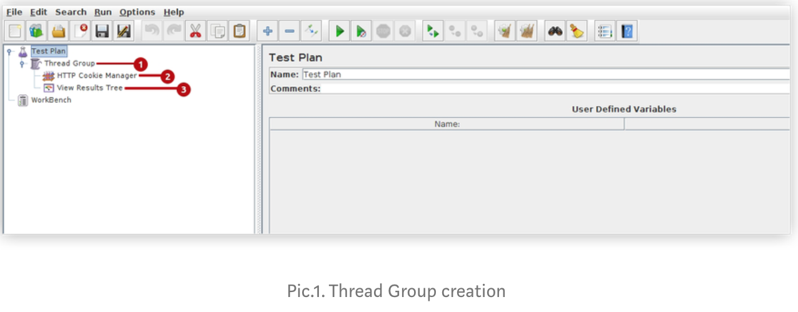

# How QA experts use JMeter

Today, web application testing needs complex and full approach which includes key and general steps: functional testing, GUI testing and load/performance testing.

## WHY JMETER? 

It was chosen for several reasons:

* open source, free tool, easy for installation and updating
* supports multi types protocols
* ability to record tests scenarios for different testing targets: Load Testing, Distributed Testing, Functional Testing, Stress Testing and Scalability Testing.
* intuitive GUI for the first acquaintance
* ability to make manual and automatic scripts recording
* it has a lot of tutorials and constant support
* many visualization reports \(charts, tables, tree, for overall view of tests\), understandable for development team and customer
* highly extensible
* JMeter is an independent java desktop application that’s why it can be run on multiple platforms
* can be integrated with Selenium, SOAP, Blazemeter, Jenkins, BadBoy, etc.

As you can see, Apache JMeter has many advantages over similar tools, but in our daily work we apply to it because it enables to execute load and performance tests for application at the different server types that include Web — HTTP, HTTPS, SOAP, Database via JDBC, LDAP, JMS, Mail — POP3.

## HOW TO USE APACHE JMETER FOR HTTPS PERFORMANCE TESTS? 

At first you should install Apache JMeter, recording will be more effective with Oracle Java 7 or later and browser Mozilla Firefox. In QA experts daily work they use HTTP\(S\) Test Script Recorder for recording HTTP and HTTP\(S\) requests in Tests plans which could be ran all the time during web application is under testing. In this case you can find steps for Test plan creation for web application with https protocols and it includes csrf tokens.

## HOW TO CREATE TEST PLAN? 

Start Apache JMeter, at first you should add Threats Group to save recording Test plan in.

_Steps:_ Right mouse click on Test Plan/Add/Threads \(Users\)/Thread Group \(1 element pic.1\)

For displaying all results after performance tests running you should add reports view. Choose any Report in the list of Listeners.

_Steps:_ Test Plan/Add/Listener/View Result Tree \(2 element pic.1\)

Add HTTP Cookie Manager to Thread Group to define additional cookie.

_Steps:_ Right mouse click on Thread Group/Add/Config Element/HTTP Cookie Manager \(3 element pic.1\).

## HOW CIRCUMVENT HTTPS AND RECORD TEST PLAN AUTOMATICALLY? 

Add HTTP\(S\) Test Script Recorder to WorkBench

_Steps:_ Right mouse click on WorkBench/Add/Non-Test Element/HTTP\(S\) Test Script Recorder \(1 element pic.2\)

For bypassing bmp, js, gif etc. elements that are not relevant to test execution press ‘Add suggested Excludes’ button \(2 element pic.2\). Check that URL Patterns to Exclude were added \(3 element pic.2\). And remember that before start recording you should choose Target Controller. From drop-down menu you should choose Test Plan &gt; Thread Group for saving recording plan to Threat Group \(4 element pic.2\).

## HOW TO CHANGE PROXY CONFIGURATION FOR RECORDING TESTS? 

We create and run tests using proxy server. Change Proxy configuration in browser. For tests recording use exclusively Mozilla FireFox browser because some other browsers \(like Chrome, etc.\) do not allow you to override system-wide configuration for their proxy settings. Open FireFox browser. Change proxy configuration

_Steps:_ find tab ‘Edit’/Preferences/Advanced/ tab Network /Settings.

At Connection settings window:

* choose ‘Manual proxy configuration’
* add ‘localhost’ to input ‘ HTTP proxy’
* add ‘8080’ to input ‘Port’.
* choose ‘Use this proxy server for all protocols’ and press ‘Ok’ button.

Check port at Test script Recorder, it should be 8080 \(5 element pic.2\) the same as in your FireFox browser.

Choose HTTP\(S\) Test Script Recorder, click ‘Start’ button \(6 element pic.2\). On the bottom of the Script Recorder window, JMeter proxy server will start and be used to intercept and record browser requests. If you are trying to record test at first time, it will display an error message that it cannot start because a certificate does not exist. Click ‘OK’ button, then click ‘Start’ one more time. You should find a message that says that a temporary certificate named Root CA certificate: ApacheJMeterTemporaryRootCA.crt created in JMeter bin directory \(pic.3\). Root Certificate CA was created and saved at Apache JMeter’s ‘bin’ folder. The root certificates are used whenever you connect via an https connection to make sure that you are connecting to who you think you are. In our case we should use our own created certificate authority to issue certificates for internal web servers. Just click OK and try to continue recording actions in FireFox browser.

Open application that will be tested at FireFox browser and make test actions step by step. Use valid credentials for authorization. All steps made by user will be recorded to Test Plan set in JMeter. After making all tests actions stop recording.

_Steps:_ open Apache JMeter/HTTP\(S\) Test Script Recorder/press ‘Stop’ button \(7 element pic.2\).

As a result all actions that user makes in application were recorded to Thread Group \(1 element pic.4\) .

If some actions were needless you can delete requests from created Test plan clicking right mouse button on excess request and finding Remove item.

Choose Thread Group and change test name \(2 element pic.4\). For loading web application properties at the Thread Group can be changed number of users, ramp-up, loop count can be chosen\) \(3 element pic.4\).

If the goal is reached and result satisfies you, do not forget to save Test plan via File/Save Test plan as… after tests were saved, you may add them to any test plan that you have open by using the “Merge” menu item, and selecting your saved WorkBench. You can work with it via other testing tools like Soap, Blazemeter , etc. just download saved .jmx file.

For running tests push ‘Start’ button at the top menu \(4 element pic.4\) and find result at View Result Tree \(5 element pic.4\)

## WHAT SHOULD YOU DO WITH REQUESTS THAT DO NOT RUN DUE TO CSRF TOKENS? 

In this application there are some csrf tokens present and due to them we have some errors with code 403 \(1 and 2 elements pic. 5\). At test result view you can find Request and Response Data.

For successful testing of this web application we need to intercept csrf tokens value and put it to our request as variable values Open login request \(1 elements pic. 6\) and find post data \(login, password and csrf token\) \(2 elements pic. 6\).

For bypassing csrf tokens value should be captured by Regular Expression Extractor and input to POST requests. Duplicate first test page at the Test Plan \(using right mouse click\). In our case it would be request 160/ \(3 elements pic. 6\). Rename it \(in our case we rename it as ‘160/ token’ \), we have two similar HTTP\(S\) requests \(4 elements pic. 6\).

First HTTP\(S\) request for getting csrf token from the body of GET request via Regular Expression Extractor. Steps: find 160/ token, right mouse click Add/Post Processors/Regular Expression Extractor\) \(5 elements pic. 6\).

Put data to Regular Expression Extractor inputs \(1 element pic.7\).

At ‘View Result Tree’ \(1 element pic. 8\) on the first test page 160/ \(2 element pic. 8\) find Response Data of the first request that gets csrftoken value \(3 element pic.8\)

_Pic.8. Find tokens value in Response Data of GET request_

At Regular Expression Extractor \(1 element pic. 9\) add csrf token line ‘name=’csrfmiddlewaretoken’ value=’xfgTXpJN5vkR4po4urpZI8tIyiuBrNvw’’ to input ‘Regular Expressions’ Change csrf token value to variable value. Using \(.+\) construction \(2 element pic.9\).

Find login POST request \(1 element pic.10\), find ‘csrfmiddlewaretoken’ \(2 element pic.10\). Change csrfmiddlewaretoken to variable value using ${token} contraction \(3 element pic.10\).

Run Test Plan and check result at View Results Tree \(1 element pic.11\). Login pass successfully \(2 element pic.11\).

Check Tasks marked red and find response data with error 403 \(3 element pic.11\). In this requests with errors \(1,3,4,5,6 elements pic.12\) you should put variable value to csrf tokens \(2 element pic.12\) at PUT requests with errors.

Try to run Test plan and check that all test’s requests were passed.

If an application has high security, csrf tokens will always be refreshable in all requests. That’s why you need to put Regular Expression Extractor to all tasks that were not passed due to variable tokens \(Duplicate GET requests and put variable value to csrf tokens at PUT requests\). In our case we take first ‘take’ request in which we find value of scrf tokens — duplicated it and implemented Extractor

Try to run Test plan and check that all tests requests were passed.

In our case two Extractors \(1, 2 elements at requests 3, 4 elements pic. 14 \) give ability to pass four requests which include csrf tokens \(5–8 elements pic. 14\).

For load, stress and performance testing we often used Apache Jmeter and Blazemeter together. It gives a more accurate and clear picture of user’s experience and how a large number of users works with application simultaneously. Full statistics returns from server and reports through graphical diagrams, tables, etc.

